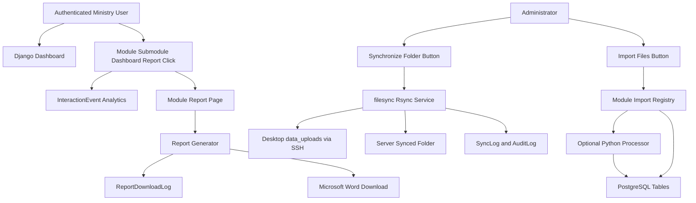

# Django Ministry Portal Plan

> Copy of the plan from this chat. Original Cursor plan file: `~/.cursor/plans/django_ministry_portal_12741da0.plan.md`

## Recommended Architecture

Create a new Django project in this workspace with a modular monolith structure. Use Django templates, Bootstrap 5, Django auth/groups, PostgreSQL, `pandas`/`openpyxl` for Excel parsing, `python-docx` for Microsoft Word report generation, and server-side `rsync` invoked by a controlled service layer.

Core paths:

- `manage.py`
- `config/settings/base.py`, `config/settings/dev.py`, `config/settings/prod.py`
- `apps/accounts/`: roles, permissions, profile helpers
- `apps/catalog/`: modules, submodules, report definitions, source definitions
- `apps/filesync/`: rsync configuration, sync service, sync logs
- `apps/imports/`: import jobs, import service, module-specific import handlers
- `apps/reports/`: Microsoft Word report generation, report files, downloads, download audit logs
- `apps/analytics/`: module/submodule/report/dashboard view and click statistics
- `apps/audit/`: central action/error audit trail
- `apps/dashboard/`: authenticated dashboard and module pages
- `templates/`, `static/`: government-style Django UI
- `data_uploads/`: synchronized Excel files on server
- `media/reports/`: generated report files
- `data_processors/`: optional Python processing scripts per module

## Rsync Recommendation

Use a server-pull model: when an administrator presses `Synchronize folder`, Django runs a restricted `rsync` command on the server that pulls Excel files from the desktop over SSH.

This is the best fit for a web button because the button action happens on the server. It requires the desktop computer to be reachable on the local network and to allow a locked-down SSH key with read-only access to the `data_uploads` folder. The command will be configured, not typed by users.

Example configuration values:

- `SYNC_SOURCE_RSYNC=desktop_user@desktop-host:/home/desktop_user/Desktop/data_uploads/`
- `SYNC_DESTINATION_DIR=/home/adm_emil/transport_portal/data_uploads`
- `SYNC_ACCEPTED_EXTENSIONS=.xlsx,.xls,.xlsm,.csv`
- `SYNC_SSH_KEY=/etc/transport_portal/keys/desktop_sync_readonly`

If the desktop cannot run SSH reliably, the fallback will be a desktop-side scheduled push into the server folder, while the web app still records and imports files from the server folder.

## Data Flow

## Database Models

Use Django migrations for all tables. Initial shared models:

- `Module`: name, slug, description, order, active flag.
- `Submodule`: module FK, name, slug, order, active flag.
- `ModulePermission`: maps users/groups to module/submodule access when default Django permissions are not enough.
- `DataSource`: submodule FK, source type, source path, accepted extensions, parser key, processor key, target model key, duplicate strategy.
- `StoredFile`: original name, server path, checksum, size, modified time, source/submodule, sync status.
- `SyncJob`: user, started/finished timestamps, status, totals found/existing/uploaded, stdout/stderr summary.
- `SyncJobFile`: sync job FK, file FK/name, action: uploaded/existing/skipped/error.
- `ImportJob`: user, stored file, submodule, status, rows imported, duplicate decision, error message.
- `ProcessedArtifact`: import job FK, produced file path, processor key, status.
- `DashboardDefinition`: name, slug, description, order, active flag, linked module/submodule/report targets.
- `ReportDefinition`: submodule FK, name, slug, format, generator key, Word template path, active flag.
- `ReportDownload`: user, report FK, module/submodule, format, timestamp, generated file path, request metadata.
- `InteractionEvent`: user, event type, module, submodule, dashboard, report, target URL, timestamp, request metadata. Event types include dashboard_view, module_view, submodule_view, report_link_click, report_preview, and report_download_start.
- `InteractionDailyStat`: date, event type, module, submodule, dashboard, report, total count, unique users.
- `AuditLog`: user, action type, status, related object label, module/submodule, file/report name, error message, metadata JSON.

First module-specific model:

- `TransitRecord`: normalized fields discovered from the first Excel sample, plus `source_file`, `import_job`, row number, and raw row JSON for traceability.

## Module Catalog Seed

- `Dashboards`: `Transit`, `İdxal/İxrac/Tranzit`, `ADY`, `PoB`, plus a main dashboard landing page that links users into dashboard cards and underlying module reports.
- `Tranzit daşımalar`: `Dinamika arayışı`, `Ölkələr üzrə arayış`, `Dəhlizlər üzrə arayış`, `Postlar üzrə arayış`, `Blok qatarlar`, `Gəlirlər`, `Qonşu ölkələrlə yük dövriyyəsi, rejimlər üzrə`
- `Ölkələrin profili üzrə hesabatlar`: `İdxal/İxrac/Tranzit`
- `Sahələr üzrə arayışlar`: `ADY`, `PoB`, `TIR-lar`, `AZAL`
- `Təşkilatlar üzrə arayışlar`: `ECO`, `Türkdilli dövlətlər`, `TRACECA`
- `Datalar`: `Tranzit`, `Xarici TIR-lar`, `Yerli TIR-lar`, `ADY / Azerbaijan Railways`, `İdxal / İxrac`, `PortOfBaku`, `AZAL / Azerbaijan Airlines`

The first authenticated page will be the main dashboard with dashboard cards first, followed by module cards.

## Synchronization Logic

Implement `apps/filesync/services.py` with a narrow service API:

- Build rsync command from settings and selected `DataSource`.
- Restrict file types with include/exclude rules.
- Run through `subprocess.run()` with timeout.
- Parse rsync itemized output to identify new, existing, skipped, and error files.
- Store file metadata and checksum after sync.
- Prevent duplicate `StoredFile` records using checksum and normalized destination path.
- Record `SyncJob`, `SyncJobFile`, and `AuditLog` entries.

The web action will be exposed only to administrators through a POST-only Django view with CSRF protection.

## Import Workflow

- `apps/imports/registry.py`: maps parser keys such as `transit_excel_v1` to handler classes.
- `apps/imports/base.py`: base importer interface: `validate()`, `process_optional()`, `import_rows()`.
- `apps/imports/handlers/transit.py`: first working importer using `pandas.read_excel()`.
- Duplicate prevention: refuse import if `StoredFile.import_status=imported` or checksum already imported, unless admin chooses explicit `replace`.

For the first module, import `Datalar -> Tranzit` Excel rows into `TransitRecord`.

## Report Download Workflow

- User opens a module/submodule page.
- Django checks module permissions.
- `InteractionEvent` records module views, submodule views, dashboard views, and report button/link clicks.
- User clicks `Download report`.
- Report service generates Microsoft Word `.docx` or PDF.
- `ReportDownload` and `AuditLog` are written before returning the file.

## Interaction Statistics

Track not only downloads, but also what users open and press:

- Dashboard views, module views, submodule views
- Report link clicks and download starts
- Admin statistics pages for most viewed dashboards/modules/submodules/reports

## Roles and Permissions

- `Ministry Worker`: can view permitted modules and download reports.
- `Module Responsible`: can view/download plus import files for assigned modules.
- `Administrator`: can manage users, modules, sync, imports, processors, reports, logs.

## UI Approach

Pages:

- Login page with ministry-style branding.
- Main dashboard with dashboard cards first: Transit, `İdxal/İxrac/Tranzit`, ADY, PoB.
- Module and submodule navigation.
- Submodule page with report download only (Word/PDF).
- Admin sync/import and statistics/audit pages.

## PostgreSQL Setup

Use PostgreSQL for production and optionally SQLite for quick local development. See `.env.example`.

## First Working Slice (implemented)

1. Django project, settings, dependencies, templates
2. Authentication, dashboard, module/submodule catalog, seed command
3. `filesync` rsync service and admin sync
4. `imports` registry and Transit Excel importer
5. Word/PDF report generation and download logging
6. `InteractionEvent` tracking and statistics page
7. Audit log and Django admin registrations
8. Focused tests

## Verification checklist

- Login works.
- Dashboard displays modules and dashboard cards.
- Admin can synchronize folder (or push from desktop via rsync).
- Admin can import Transit files.
- Users can download Word/PDF reports.
- Sync, import, interaction, download, and error events appear in logs.
